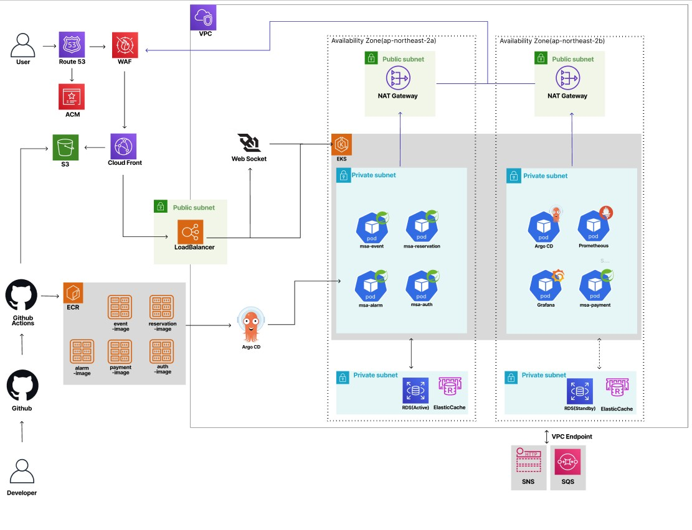
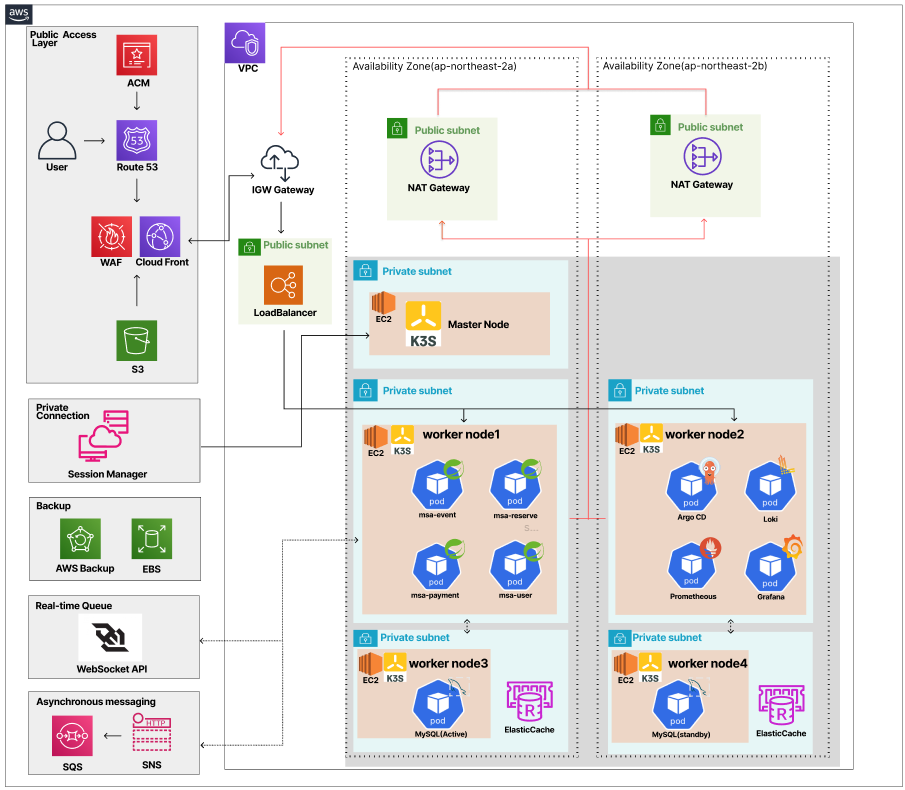

# S7AGE – 공연 예매 시스템 인프라 (Infra / DevOps)

> - Java Spring + React 기반 실시간 좌석 예약 플랫폼  
> - 팀 프로젝트  **인프라·DevOps 담당**으로 설계·구축한 내용을 정리

---

## - 프로젝트 개요

| 항목 | 내용 |
|------|------|
| **기간** | 2024.11 ~ 2025.02 (3개월) |
| **팀 구성** | 3인 |
| **역할** | 인프라·DevOps 담당 |
| **배포** | 도메인 + HTTPS 적용, 실서비스 배포 |

---

## - 개인 역할 요약

- 팀 내 **인프라·DevOps 담당** 엔지니어
- AWS 기반 서비스 인프라 **설계·구현·배포**
- Terraform·Ansible 기반 **인프라 자동화** 구현
- GitHub Actions + ArgoCD 기반 **CI/CD 및 GitOps** 구축
- 모니터링·로그·알림 체계 **구성 및 장애 대응 경험**

---

## - 아키텍처

> 초기 EKS + ECR + RDS 구성에서 **비용 최적화**를 위해 K3s + GHCR + MySQL Pod로 변경


**초기 설계안:**



**비용 최적화 변경 사항:**
| 초기 설계 | 실제 구현 | 이유 |
|----------|----------|------|
| EKS | K3s (EC2) | 관리형 비용 절감 |
| ECR | GHCR | 무료 레지스트리 |
| RDS | MySQL Pod | DB 비용 절감 |

**최종안:**




**설계 vs 실제 구현 차이점:**

아키텍처 다이어그램에는 MySQL Active/Standby 이중화 구성으로 표현되어 있으나, 실제 구현에서는 비용 및 리소스 제약으로 **단일 MySQL Pod**로 운영.


| 항목 | 다이어그램 | 실제 구현 | 비고 |
|------|-----------|----------|------|
| MySQL | Active + Standby | 단일 Pod | EBS 볼륨으로 영속성 확보 |


> **프로덕션 환경 권장 구성:**  
> - StatefulSet 기반 Primary-Replica 구성 또는 RDS Multi-AZ 적용
> - 자동화된 백업 및 Point-in-Time Recovery 설정
> - 장애 발생 시 자동 Failover 구성

**구성 요약:**
- **CloudFront + S3**: 정적 프론트엔드 제공
- **VPC 내부 EC2 기반 K3s**: Kubernetes 클러스터 (Master 1 + Worker 4)
- **Nginx Ingress**: MSA 트래픽 라우팅 (user / reserve / other /payment)
- **ElastiCache (Redis)**: 세션 및 캐시 처리
- **WAF**: 외부 공격 대비


---

## - 레포지토리 구조

```
s7age-infra/
├── terraform/           # AWS 인프라 IaC
├── ansible/             # 서버·클러스터 자동화
├── k8s/
│   ├── apps/            # ArgoCD Application (각 서비스 레포 참조)
│   ├── ingress/         # 환경별 도메인 분리
│   ├── values/          # Helm values
│   ├── namespace/       # namespace 관리
│   └── manifests/       # 서비스 k8s 예시 (base/overlays)
├── ci-cd/               # GitHub Actions 워크플로우
│   ├── front-deploy.yml
│   ├── backend-deploy.yml
│   ├── zap-full-scan.yml
│   └── zap-passive-scan.yml
└── docs/                # 아키텍처 문서
```

---

## - 기술 스택

| 분류 | 기술 |
|------|------|
| **Cloud** | AWS (VPC, EC2, S3, CloudFront, Route53, WAF, ACM, ElastiCache) |
| **Container** | K3s, Docker, Helm, Kustomize |
| **IaC** | Terraform , Ansible  |
| **CI/CD** | GitHub Actions, ArgoCD, GHCR |
| **Security** | Semgrep (SAST), Trivy (Image Scan), OWASP ZAP (DAST) |
| **Monitoring** | Prometheus, Grafana, Loki, OTel Collector, Alertmanager → Discord |

---

## - 주요 구현 내용

### 1. IaC 자동화

**Terraform**
- `workspace` 기반 dev / prod 환경 분리
- 네트워크·EC2·Redis·보안 리소스 모듈화
- Output 값을 Ansible 인벤토리로 연동
- 환경별 시크릿/권한 자동 구성 (`${var.environment_name}_AWS_ROLE_ARN`)
- Terraform S3 Remote Backend로 tfstate 중앙 관리
- DynamoDB State Lock 적용으로 동시 실행 충돌 방지

**Ansible**
- SSM 기반 원격 관리로 Bastion 제거
- Role 단위로 K3s, Ingress, Monitoring 자동 설치
- Vault로 민감 정보 암호화 관리

### 2. CI/CD & GitOps

- **MSA 멀티 레포 구조**: 중앙 ArgoCD 레포에서 각 서비스 레포를 연결해 배포 관리
- **Ansible로 ArgoCD 연결** → 이후 자동 배포 및 동기화
- 환경별(dev/prod) 자동 동기화 (`prune`, `selfHeal`)

> ci-cd 폴더에 각 서비스별 GitHub Actions 워크플로우 예시 포함

**프론트엔드 (React → S3 + CloudFront)**
- GitHub Environments (DEV/PROD) 분리
- OIDC로 AWS 자격 증명 (시크릿 키 없이)
- S3 배포 + CloudFront 캐시 무효화

**백엔드 (Spring → K3s)**
- Semgrep/Trivy 보안 스캔 → GHCR Push → ArgoCD 배포

```
Code Push
  → Semgrep (SAST)
  → Docker Build
  → Trivy (Image Scan)
  → GHCR Push
  → ArgoCD 배포
```

**환경별 설정 분리:**
```yaml
# GitHub Actions - 브랜치별 환경변수 주입
- name: Set image tag & DDL_AUTO by branch
  run: |
    if [[ "${GITHUB_REF_NAME}" == "dev" ]]; then
      echo "DDL_AUTO=update" >> $GITHUB_ENV    # 스키마 자동 변경
    else
      echo "DDL_AUTO=validate" >> $GITHUB_ENV  # 스키마 검증만
    fi
```

```yaml
# application.yml - 환경변수 참조
jpa:
  hibernate:
    ddl-auto: ${DDL_AUTO:validate}
```

- ArgoCD **App of Apps** 구조로 배포 관리

### 3. Kubernetes 보안 강화

Semgrep 보안 경고 대응으로 컨테이너 보안 설정:

```yaml
# Deployment
securityContext:
  runAsNonRoot: true
  runAsUser: 1000
  allowPrivilegeEscalation: false
  readOnlyRootFilesystem: true
  capabilities:
    drop: ["ALL"]
```

```dockerfile
# Dockerfile
RUN addgroup -S -g 1000 app \
 && adduser  -S -u 1000 -G app app
USER 1000:1000
```

### 4. 환경별 배포 구성 (Kustomize)

```
k8s/
├── base/                 # 공통 설정
└── overlays/
    └── dev/              # dev 환경 패치
```

**dev 환경 패치 예시:**
```yaml
# ingress-patch.yaml
- op: replace
  path: /spec/rules/0/host
  value: devapi.s7age.com
- op: replace
  path: /metadata/annotations/nginx.ingress.kubernetes.io~1cors-allow-origin
  value: "https://dev.s7age.com"
```

### 5. 모니터링 & 알림

- **Prometheus**: 클러스터 및 서비스 메트릭 수집
- **Grafana**: 대시보드 구성
- **Loki**: 중앙 로그 관리
- **Alertmanager → Discord**: 장애 알림 연동
- **OpenTelemetry Collector**: 로그 수집 (Promtail EOL 대응)

---

## - 장애 대응 경험

| 상황 | 대응 | 결과 |
|------|------|------|
| Trivy HIGH/CRITICAL CVE 탐지 | 라이브러리 및 베이스 이미지 수정 | 보안 검사 통과 |
| Semgrep 보안 경고 | 컨테이너 보안 설정 강화 | CI 보안 게이트 충족 |
| DB Pod 비정상 종료로 데이터 손상 | scale-down → drain → uncordon → scale-up 절차 학습 | 안전한 종료/복구 프로세스 정리 |

---

## - 개선 및 학습

- 초기 단일 레플리카 운영 → 노드 장애 시 서비스 중단 경험
- 부하 테스트 후 HPA 적용으로 오토스케일링 구성
- 무중단 운영을 위한 복구 전략 필요성 체감

---

## - 회고

Terraform과 Ansible로 인프라를 코드화하며 단순한 서버 구성보다 **도구 간 연결과 흐름**이 중요하다는 점을 배웠습니다. 레포 구성에 따라 CD 배포 전략이 달라진다는 것도 알게 되었고, 이 과정에서 다양한 기술을 폭넓게 경험할 수 있었습니다.

실제 장애를 겪고 복구 시나리오를 고민하면서 **운영 환경을 고려한 설계 관점**을 키우게 된 프로젝트였습니다.
